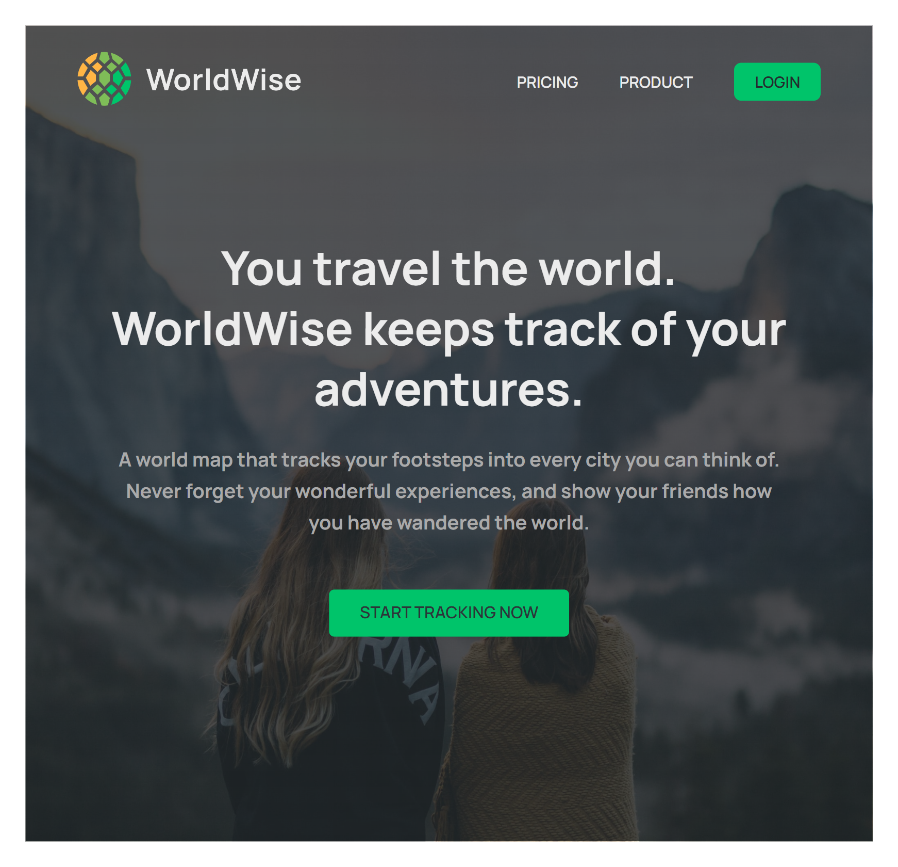
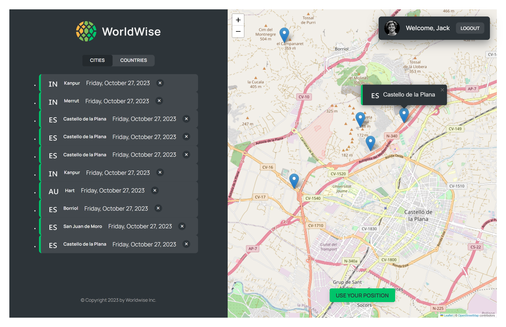
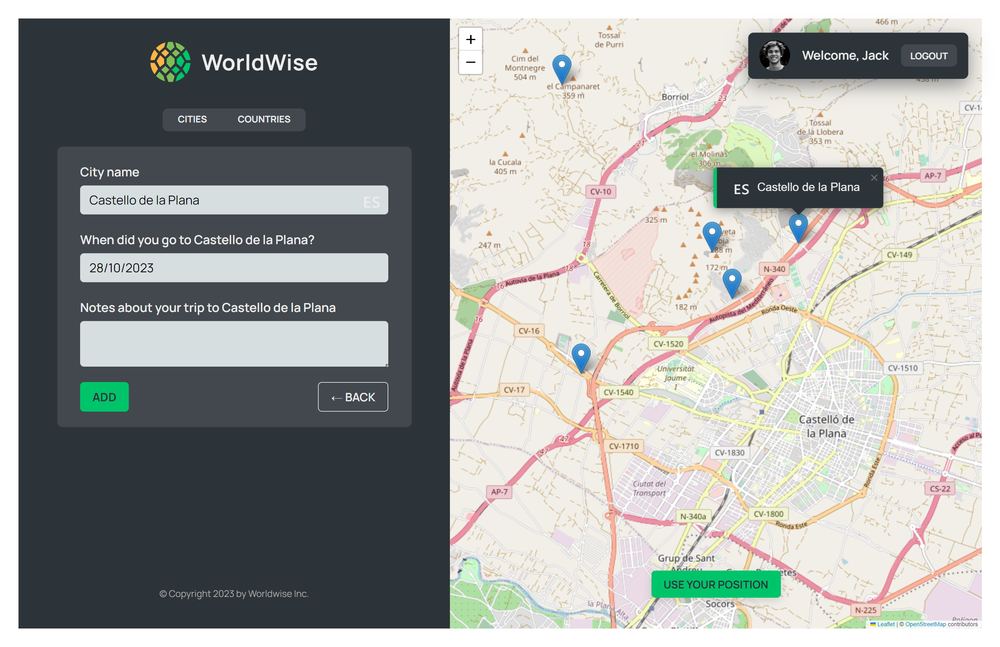

# 🌍  WorldWise-History-of-Travel 🌐
Welcome to the Worldwise- History -of-Travel Project, a comprehensive full-stack application that allows you to explore and record your travel history. Let's dive into the key features of our exciting project:

Explore the world's travel history and get hands-on with cities, countries, and your own personal journey on our interactive map! 🗺️

##  Frontend - React 🚀

1. 🗺️ **Interactive Map:** Personalize your global travel history by marking the places you've visited on our interactive map..

2. 📆 **Journey through Time:** Discover travel stories from different times and learn about the adventures of explorers and travelers.

3. 🌆 **City Insights:** Get to know cities better. Learn about their culture, landmarks, and what makes them special.

4. 🌎 **Country Exploration:** Dive into countries' histories and their contributions to the world of travel.

5. 🔐 **Simple Authentication:** Test features safely with fake authentication. No real usernames or passwords needed.

##  Backend - Spring Boot 🛠️

1. 🔐 **JWT Token Authentication :** Enhance the security of user data with JWT token authentication, preventing unauthorized access and ensuring a safe travel 

2. 🌍 **API for Travel List Operations :** We've created a powerful API enabling you to seamlessly save, update, and delete travel entries. Interact effortlessly with your travel data to keep it up-to-date.

3. 🌆 **MySQL Database Integration:**  Enjoy persistent and reliable data storage with a MySQL database. Your travel history is securely stored, ready for future explorations.

  

